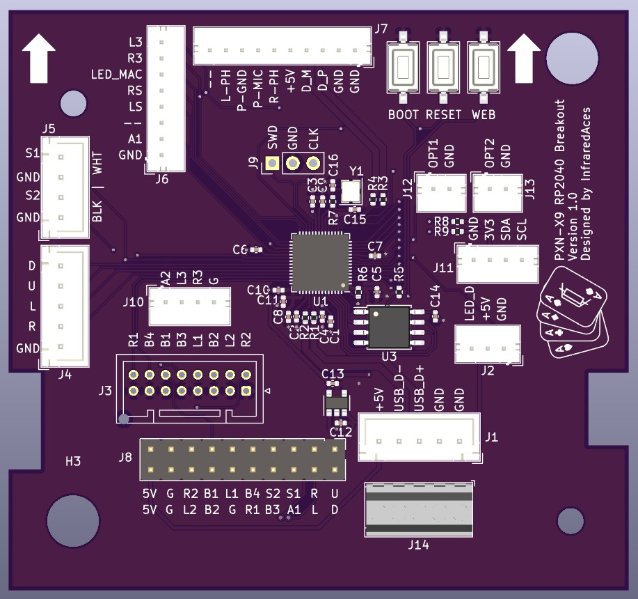
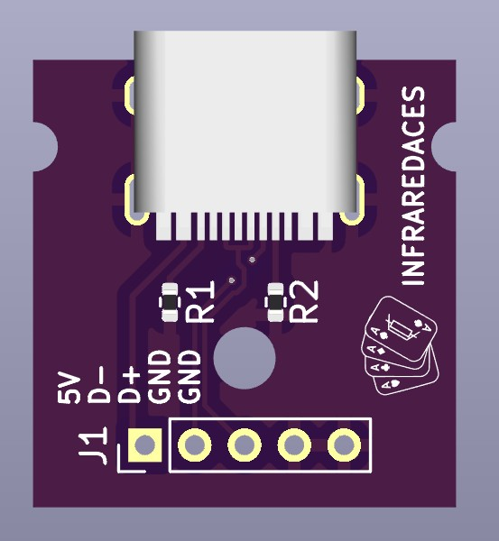
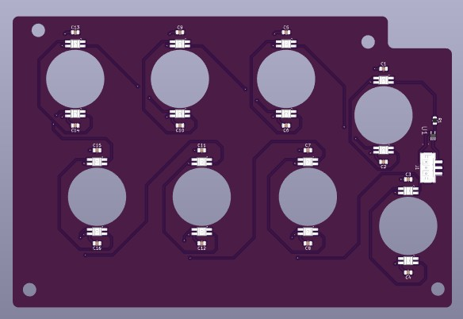
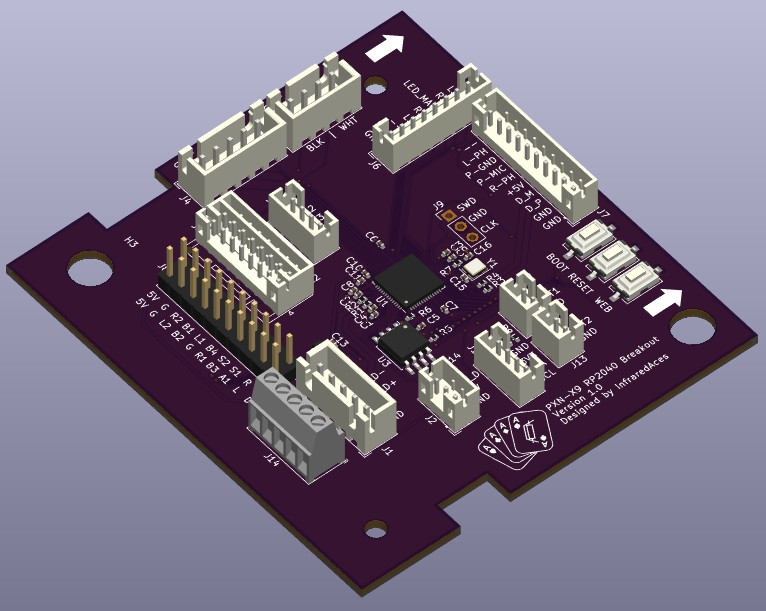
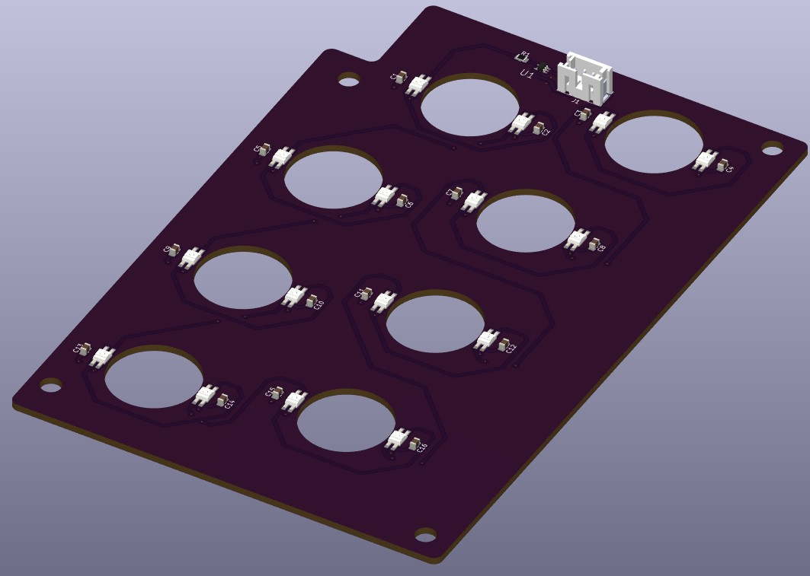

# GP2040-CE PXN X9 Replacement Board

## Attribution

The following text must be included in any distribution of derivatives of this board. All links must also be included.

Copyright 2023 [InfraredAces](https://github.com/InfraredAces)

Licensed under CC BY 4.0

Changes from the original design:

    list any changes you make here

---

## Summary

These boards are meant to act as drop in replacements of the boards found in a [PXN-X9 Arcade Stick](https://www.e-pxn.com/products/arcade-stick/pxn-x9). They use the stock cables in the controller with additional pins and headers depending on desired features.

Additional Features:

- OLED Display
- Optional Pin 1 (GPIO Pin)
- Optional Pin 2 (GPIO Pin)
- 2 Additional GPIO Pins through Microphone Port

## Board Design

### Main Control Board

Plugging in the board with the stock cables in the PXN-X9, the primary difference from stock firmware functionality is the loss of the `ON/OFF` and `MACRO` button functionality as they are reappropriated for `L3` and `R3` respectively. Otherwise, the rest of the buttons and slider should work as normal. Of the GP2040-CE inputs, `A2` is missing and will need to be substituted with a hotkey combination, if necessary.

There are a few redundant headers and screw terminal in the event that there is an alternative wiring need.

- The 20 pin header (J8) and JST PH-4P 2.00mm (J10) follows the layout of the common [Brook wiring harness](https://www.brookaccessory.com/detail/59387342/).
- The 5P screw terminal (J14) has the same order of pins from left to right as the primary JST XH-5P 2.50mm (J1) used for the stock USB port board. Either can be used in conjunction with the [USB-C Replacement Board](#usb-c-replacement-board), depending on the wiring needs.

USB Passthrough is available through the PXN-X9's USB port and is external to the controller.

| GPIO Pin | Input/Function     | Note                                        |
| :------: | :----------------- | ------------------------------------------- |
|    0     | PIN_BUTTON_B1      | J3 & J8 (20 Pin)                            |
|    1     | PIN_BUTTON_B3      | J3 & J8 (20 Pin)                            |
|    2     | PIN_BUTTON_L1      | J3 & J8 (20 Pin)                            |
|    3     | PIN_BUTTON_B2      | J3 & J8 (20 Pin)                            |
|    4     | PIN_BUTTON_L2      | J3 & J8 (20 Pin)                            |
|    5     | PIN_BUTTON_R2      | J3 & J8 (20 Pin)                            |
|    6     | BOARD_LEDS_PIN     | J2                                          |
|    7     | Optional Pin 1     | J12 JST PH 2-Pin (Unused with Stock Cables) |
|    8     | I2C_SDA_PIN        | J11 (Unused with Stock Cables)              |
|    9     | I2C_SCL_PIN        | J11 (Unused with Stock Cables)              |
|    10    | Optional Pin 2     | J13 JST PH 2-Pin (Unused with Stock Cables) |
|    11    | Right Microphone   | J7                                          |
|    12    | Left Microphone    | J7                                          |
|    13    | PIN_BUTTON_L3      | J6 & J10                                    |
|    14    | USB Host Port (D+) | J7                                          |
|    15    | USB Host Port (D-) | J7                                          |
|    16    | PIN_BUTTON_R3      | J6 & J10                                    |
|    17    | LED Macro          | J6 (Unused with Stock Cables)               |
|    18    | PIN_SLIDER_TWO     | J6                                          |
|    19    | PIN_SLIDER_ONE     | J6                                          |
|    20    | PIN_BUTTON_A2      | J10 (Unused with Stock Cables)              |
|    21    | PIN_BUTTON_A1      | J6 & J8 (20 Pin)                            |
|    22    | PIN_BUTTON_S2      | J5 & J8 (20 Pin) & Web Button               |
|    23    | PIN_BUTTON_S1      | J5 & J8 (20 Pin)                            |
|    24    | PIN_DPAD_DOWN      | J4 & J8 (20 Pin)                            |
|    25    | PIN_DPAD_UP        | J4 & J8 (20 Pin)                            |
|    26    | PIN_DPAD_LEFT      | J4 & J8 (20 Pin)                            |
|    27    | PIN_DPAD_RIGHT     | J4 & J8 (20 Pin)                            |
|    28    | PIN_BUTTON_R1      | J3 & J8 (20 Pin)                            |
|    29    | PIN_BUTTON_B4      | J3 & J8 (20 Pin)                            |

### USB-C Replacement Board

This board is not necessary as an immediate replacement, but is available should the need to replace the USB-C port on the PXN-X0 come up.

Wires will need to be soldered onto the

### LED Replacement Board

The preexisting LED board that comes with the PXN-X9 does not work with the primary controller PCB replacement board as they are not addressable. Another LED board is necessary for the use of LEDs with this board.

This board is currently a work in progress. The data pin for `LED_DATA` is 3.3V logic and will need to be converted to 5V logic for addressable RGB LEDs to function properly. This logic shifter will be included on the LED Replacement Board itself in the event that the `LED_DATA` pin is needed for some other application.

## Assembly

NOTE: This applies to the Main Control Board and the LED Replacement Board only.

These boards are designed to be made and assembled by JLCPCB. As such, you will find a folder called `production_files` that contains a copy of the three files needed to have each of these 3 boards made by JLCPCB.

For each board, the 3 files are:

- A GERBER file for the design of the board
- A BOM file for the list of parts to be assembled
- A CPL file for the placement of the parts in the BoM file

This design includes both SMD and through hole parts from JLCPCB. There are additional costs associated with having through hole parts added to the board.

These boards have been designed to be fully assembled by JLCPCB. You will not need to do any soldering or assembly of any kind should you order a batch of them. The only thing you will need to do is flash the boards with the pre-compiled GP2040-CE firmware (i.e. "GP2040-CE_X.X.X_PXN-X9.uf2") in the `firmware` folder and then test the boards.

Please note that we are not responsible for issues that arise from the manufacturing of these boards done through JLCPCB or any other manufacturer. These board files have been ordered and tested for functionality.

## Ordering

NOTE: This applies to the Main Control Board and the LED Replacement Board only.

1. Go to JLCPCB.com
2. Click on Instant Quote
3. Click on Add Gerber file and choose the file named Gerber - `GERBER-boardname.zip` from the `production_files` folder
4. Choose the following options for the board:
   - Base Material = FR-4
   - Layers = 2
   - Dimensions = (Automatically Calculated)
   - PCB Qty = (Minimum of 5)
   - Product Type = Industrial/Consumer electronics
   - Different Design = 1
   - Delivery Format = Single PCB
   - PCB Thickness = 1.6
   - PCB Color = (up to you)
   - Silkscreen = (defaults to white for all except white boards which is black)
   - Surface Finish = LeadFree HASL (recommended)
   - Outer Copper Weight = 1oz
   - Via Covering = Tented
   - Board Outline Tolerance = +/- 0.2mm (Regular)
   - Confirm Production file = Yes (Recommended)
   - Remove Order Number = Specify a Location
   - Flying Probe Test = Fully Test
   - Gold Fingers = No
   - Castellated Holes = No
   - No advanced options
5. Choose the following options for the PCB assembly
   - PCBA Type = Economic
   - Assembly Side = Top Side
   - PCBA Qty = (Minimum of 2)
   - Tooling holes = Added by Customer
   - Confirm Parts Placement = Yes
6. Make sure you have read the terms and conditions of JLCPCB assembly service and then click on the `Confirm` button if you agree
7. The Bill of Materials page will show you a render of the board without parts. You can click the `NEXT` button here unless you see any issues with the board
8. You will now have the option to upload two files:
   - For the Add BOM File you will need to choose the BOM - `BOM-boardname.csv` file that is located in the `production_files` folder
   - For the Add CPL File you will need to choose the CPL - `CPL-boardname.csv` file that is located in the `production_files` folder

Once these two files have been uploaded you can press the Process BOM & CPL button.

9. You will now see a list of components that will be used to assemble the boards. If there are not listed issues here you can click on on the `NEXT` button.
10. There will now be a render of the board with parts on the Component Placements page. Check this page to make sure that all parts are in the correct spots and orientation.

11. The quote & order page will give you a breakdown of the costs associated with the boards and assembly parts based on the quantity you have chosen. This does not include shipping. Shipping will be calculated at a further step.

If all looks well here you can click on the `SAVE TO CART` button.

12. The Secure Checkout process will be different based on your location in the world. We recommend researching your shipping options to choose the one that is right for your application.

## Firmware Install

When receiving the board from the PCB manufacturer after assembly and plugging in the board to a computer via USB (J1 or J14), the board should connect as a drive labelled `RPI-RP2`. If the drive does not automatically mount, mount the drive.

Drag and drop the precompiled firmware (i.e. "GP2040-CE_X.X.X_PXN-X9.uf2") from the `firmware` folder onto `RPI-RP2`. Then wait for the device to automatically disconnect.

## Revision History

| Version | Notes           |
| :------ | :-------------- |
| v1.0    | Initial Release |

## Acknowledgements

- [jfedor](https://github.com/jfedor2) for the [circuit schematic design](https://github.com/jfedor2/hid-remapper/tree/master/custom-boards/v3/kicad)
- [FeralAI](https://github.com/FeralAI) for starting the GP2040 project and the original design of the Pico Fighting Board
- Everyone that works on the GP2040-CE project to make it the best controller firmware around
